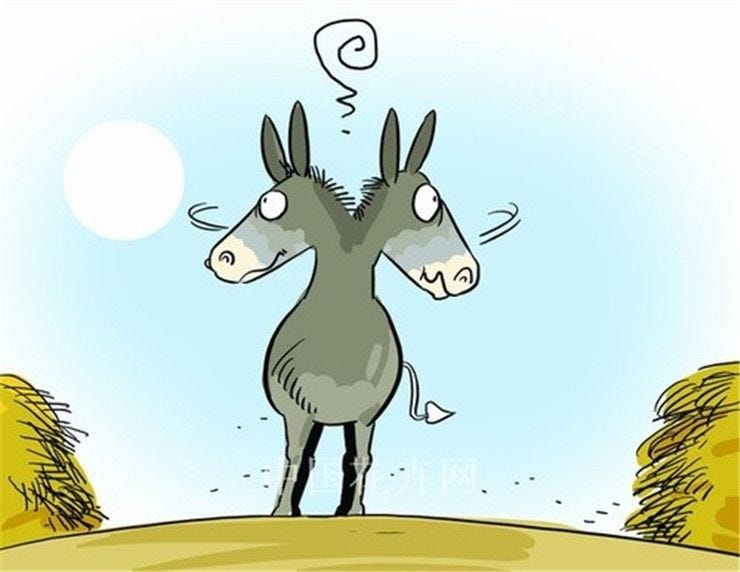

### The Guillotine
Joseph-Ignace Guillotin was an 18th-century French physician who starkly opposed the death penalty. He's also the man whose advocacy for a humane killing device backfired so spectacularly that it ended up bearing his name: the guillotine.

Like many of us, Dr. Guillotin wasn't a fan of human suffering. After failing to abolish the death penalty in 1789, he decided that his next best option was to minimize the suffering it caused. In its current state, the death penalty was inequitably cruel — nobles would die by a quick run in with a blade, but commoners (which was synonymous with “the poor” in 1780s France) were met with slower and more painful methods (rope, fire, the breaking wheel, etc.). To this end, Guillotin proposed that a single mechanical device be used for all executions — one which was as painless as possible for the executee, regardless of class. The device was ultimately designed by physician Antoine Louis and built by engineer Tobias Schmidt, but it was Guillotin's name that stuck.

Guillotin spent much of the rest of his life regretting that association. His family petitioned the French government to rename the device; when the government refused, they changed their own surname instead.

The guillotine did as expected: it killed people. During The Terror, 17 thousand people died from its blade. The issue wasn’t that the guillotine didn’t encode the Doctor’s norms—the killing was equitable, merciful and dignified. The issue was that the guillotine made killing too efficient. In other words, the guillotine smuggled “we should kill people efficiently” inside “we should kill people humanely.”

<figure>
  
  <figcaption>Guillotine, 2007 (Robert Priseman)</figcaption>
</figure>

---
### Hume's Guillotine
Fifty years prior, legendary philosopher and self-proclaimed ladies’ man David Hume published his “Treatise on Human Nature” which interrogated many questions concerning natural philosophy (which we now call scientific reasoning) and moral philosophy. Of these questions, the most salient to this day is known as the “is-ought problem”—or, relevantly named “Hume’s Guillotine.”

Like Dr. Guillotin, Hume wasn’t a fan of human suffering. Though Hume's suffering was of a different kind — the sort one experiences reading bad moral philosophy. 

Hume was surprised to notice a logical leap present in many of his colleagues' work. 

is: It is raining

ought: We should go inside

is: It is raining

normative premise: We'd prefer to not be wet

ought: We should go inside

---

Hume's guillotine throws a wrench in the plan of every

I'm sure I need not explain the ways in which AI The prototypical algorithmic bias example is a racially biased recedevism algorithm known as COMPAS. If you aren't familiar, COMPAS

---

<figure>
  
  <figcaption>Burdian's Ass</figcaption>
</figure>